This document only apply for HTG and was maintained by PeakVN. 
Contact info: binh.trinh@peakvn.com

# Table of contents
1. [Technical stack](#Technicalstack)


2. [Connecting to the Database](#2)


2.1. [About Local Connections](#2.1)

2.2. [About Remote Connections](#2.2)

2.2.1 [Oracle Client Software](#2.2.1)

2.2.2 [Connect Strings](#2.2.2)

3. [Apply in HTG](#3)

4. [Create and Grant access](#4)

# <a id='Technicalstack'>Technical stack</a>
- OS: Windown Server 2016 or newer
- Application: Power BI
- Programming language: Python3
- Software: Oracle Client Instant 18 or newer
- Connection API: ODBC (Open Database Connectivity)
- Oracle Data Access Components (optional when using naitive connection)


# <a id='2'>Connecting to the Database</a>

Depend on the your host, Oracle Database XE supports connections between SQL Command Line (SQL*Plus) and the database either locally, or remotely over a TCP/IP network. The method that you use to connect to Oracle Database XE with SQL Command Line depends on whether you are initiating a local connection or a remote connection. Local and remote connections are explained in the following sections:

1. Local Connections
2. Remote Connections

## <a id='2.1'>About Local Connections</a>

Connecting locally means running SQL Command Line (or any other Oracle command-line utility) on the same host computer where Oracle Database XE is installed (the "Oracle Database XE host computer") and then initiating a database connection from SQL Command Line (or other utility). To connect locally, you must supply only a database user name and password. For example, picture below shows a user connecting locally with SQL Command Line and entering a connect command that supplies the user name hr and password hr.

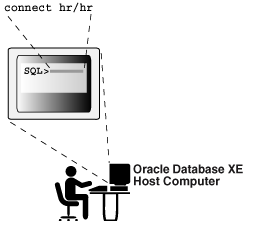


This connection usually apply for sysadmin


## <a id='2.2'>About Remote Connections</a>

Connecting remotely means running SQL Command Line (or any other Oracle command-line utility) on a computer other than the Oracle Database XE host computer, and then initiating a database connection from SQL Command Line (or other utility) over the network.

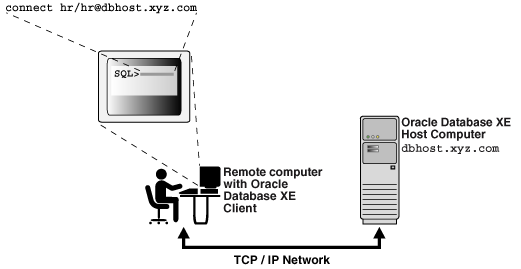

### <a id='2.2.1'>Oracle Client Software</a>
The remote computer must have Oracle client software installed. It is through Oracle client software that Oracle command-line utilities (and your applications) connect to the database. Oracle Database XE accepts connections from all of the following types of Oracle client software:

- Oracle Database Express Edition Client (Oracle Database XE Client)
When you install Oracle Database XE, Oracle Database XE Client is also installed on the same computer. You can install Oracle Database XE Client separately on remote computers
- Instant Client

```
All Oracle client software includes Oracle Net, which is the Oracle network software that enables client applications on one computer to connect to databases on another computer over a network.
```

### <a id='2.2.2'>Connect Strings</a>

To connect remotely, you must supply not just a user name and password, but a complete Oracle Net connect string. In addition to the database user name and password, a connect string includes a host name or host IP address, an optional TCP port number, and an optional database service name. These additional parameters are required to help Oracle Net find the right host computer and connect to Oracle Database XE. An Oracle Net connect string has the following format:

```
username/password@[//]host[:port][/service_name]

where:
- // is optional
- host is the host name or IP address of the computer that is running Oracle Database XE
- port (optional) is the TCP port number on which the Oracle Net listener is listening. If not specified, the default port number 1521 is assumed.
- service_name (optional) is the name of the database service to which to connect. For Oracle Database XE, the service name is XE. If service_name is omitted, Oracle Database XE Client appends a request for the default database service, which is configured during installation as XE.
```

This connection usually apply for end user such as: Data Analyst, Data Engineer

# <a id='3'>Apply in HTG </a>
## Direct Connection
### Local Connections

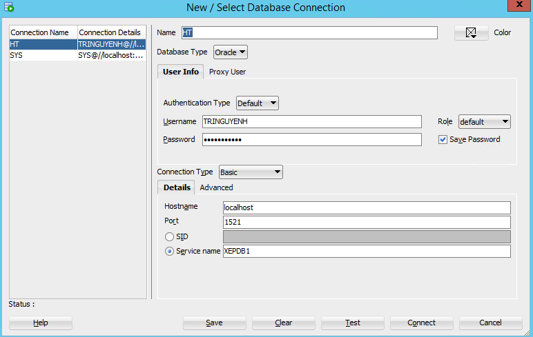

### Remote Connections
1. Check OCI is available
```cmd
sqlplus
```
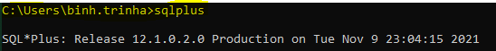
2. Connection to Database

```cmd
sqlplus no/log
```
```sql
CONNECT TRINGUYENH/password_htg@//103.163.214.72:1521/XEPDB1
```
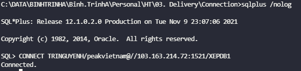
```sql
SELECT * FROM T_D_ACCOUNT_TYPE;
```
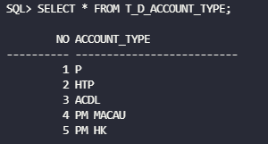

## SQL Developer Connection

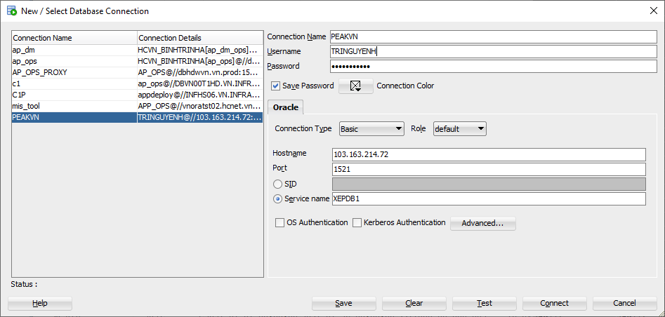

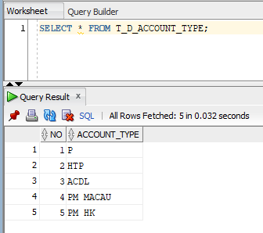

## Application connection

### PBI connection
1. Get data > Oracle database

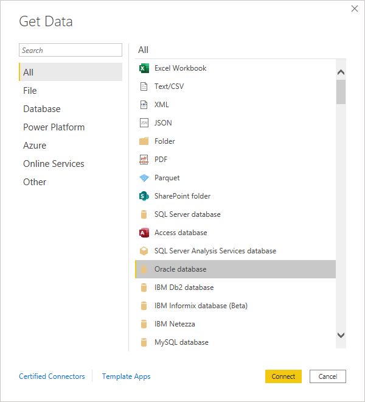
2. Input database server information

> 103.163.214.72:1521/XEPDB1

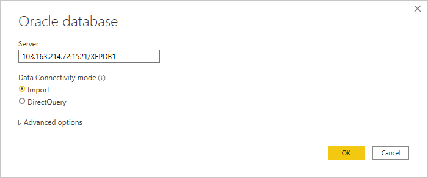

3. Tick related schema and table

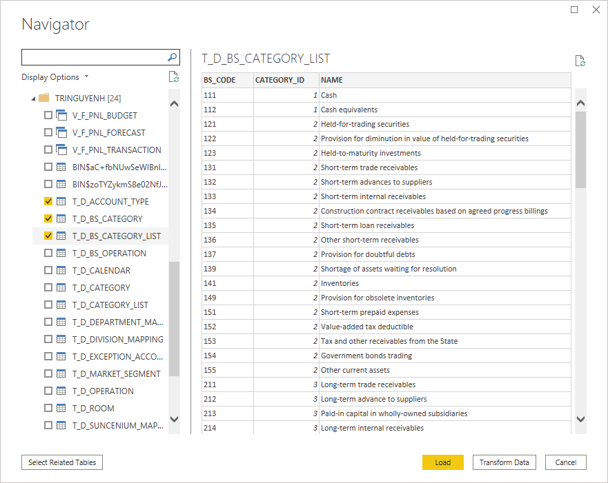

4. Visualization

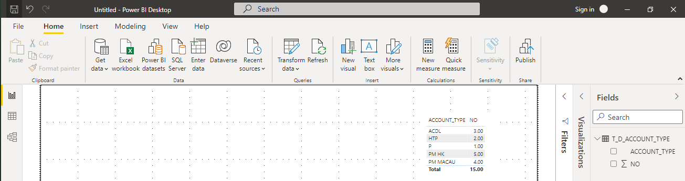

### Programming language connection - Python

```py
import cx_Oracle

db_conn = cx_Oracle.connect('TRINGUYENH/password_htg@//103.163.214.72:1521/XEPDB1', encoding = "UTF-8")
cursor = db_conn.cursor()
cursor.execute('SELECT * FROM T_D_ACCOUNT_TYPE')

print(cursor.fetchall())
```

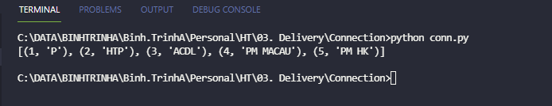

# <a id='4'>Create and Grant access</a>
```sql
--CREATE USER;
CREATE USER AP_HTF IDENTIFIED BY AP_HTF_password; 
--GRANT SESSION TO USER FOR LOGIN
grant create session to AP_HTF;

--GRANT ROLE TO USER
grant create view, create procedure, create sequence, create table to AP_HTF;

--Assign the quota by altering the user, like so:

alter user AP_HTF quota unlimited on users;

COMMIT;
```